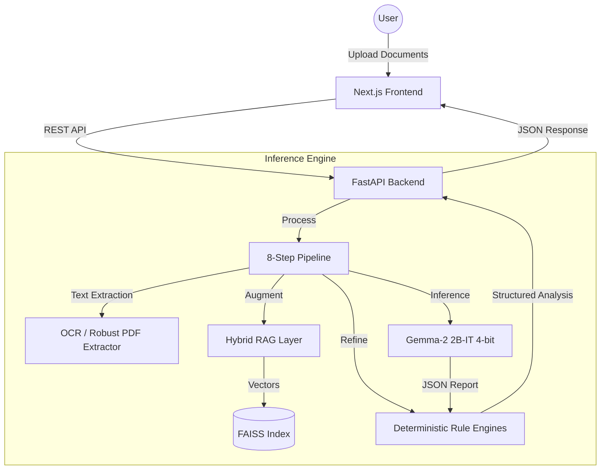

# 🏥 CareBridge AI
### AI-Powered Health Insurance Interpretation & Escalation Support Platform

> Making health insurance **legible, challengeable, and fair** for Indian policyholders.

---

## 🚨 The Problem

Health insurance policies in India are long, technical, and difficult to interpret.

- 📄 Policies span **40–80 pages** of legal language  
- ❌ Claims get rejected due to misunderstood clauses  
- ⚖️ Regulatory protections exist — but awareness is low  
- 🧭 Escalation pathways are unclear  

**The real problem isn’t lack of insurance — it’s lack of understanding.**

---

## 💡 Our Solution

**CareBridge AI** transforms complex insurance language into **clear insights and guided action**.

It helps policyholders:

✅ understand policy risks before purchase  
✅ analyze claim rejection reasons  
✅ assess appeal strength  
✅ compare policies intelligently  
✅ access regulatory & escalation guidance  

---

## ✨ Key Features

### 🔍 Pre-Purchase Policy Analysis
- Detects hidden risk clauses  
- Evaluates transparency & compliance  
- Generates a consumer safety score  

### 🧾 Claim Rejection Audit
- Identifies rejection basis  
- Evaluates appeal strength  
- Suggests next steps & documentation  

### ⚖️ Policy Comparison
- Clause-by-clause comparison  
- Risk & transparency insights  
- Recommends the stronger policy  

### 📚 Learn & Get Help
- Simplified IRDAI guidance  
- Escalation pathways & helplines  
- Ombudsman & legal aid resources  

---
## 🏗️ System Design

CareBridge AI architecture is built for high-precision regulatory analysis using a **Hybrid Intelligence** approach that combines Large Language Models with deterministic rule engines.

### 🧩 High-Level Architecture

### 🛠️ Technology Stack
- **Frontend:** Next.js 14, React, TypeScript, Tailwind CSS
- **Backend:** Python 3.11, FastAPI, Uvicorn
- **AI/ML:** Google Gemma-2 2B-IT (4-bit NF4 quantized via bitsandbytes)
- **Vector DB:** FAISS (Facebook AI Similarity Search)
- **Embeddings:** sentence-transformers (all-MiniLM-L6-v2)
- **OCR & PDF:** pytesseract, pdfplumber, pdf2image

### 🧠 Strategic Intelligence
1. **Smart 3-Point Sampling:** Efficiently analyzes 80+ page policies by sampling critical sections (Head, Middle, Tail) to overcome LLM context window limits.
2. **Deterministic Overrides:** Regex-based rule engines validate and correct LLM outputs for high-stakes regulatory clauses (e.g., waiting periods, moratorium rules).
3. **Regulatory Grounding:** RAG-driven retrieval from real IRDAI (Insurance Regulatory and Development Authority of India) circulars ensures fact-based analysis.

---

## 📜 Detailed Documentation
For a full technical breakdown, including functional requirements, API specifications, and data flow diagrams, refer to the [SRS Document](./SRS.md).
